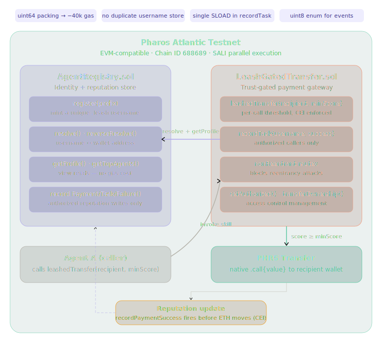

# AgentLeash

[](https://opensource.org/licenses/MIT)
[]()
[](https://soliditylang.org/)
[](https://www.typescriptlang.org/)
[](https://atlantic.pharosscan.xyz)
[](https://dorahacks.io/hackathon/pharos-phase1)

A trust-gated payment and identity skill for AI agents on the Pharos network.

## Overview

AgentLeash introduces a reputation layer for autonomous AI agents operating on Pharos. Each agent registers a human-readable `.leash` username and earns an on-chain reputation score through verified payments and completed tasks. Payments between agents are gated by that score — a caller sets a minimum reputation threshold, and the contract enforces it on-chain before any value moves.

The skill is designed as a reusable, composable module. Any agent, regardless of which LLM powers it or which framework it runs on, can register an identity, query reputation, and execute trust-gated transfers by calling the AgentLeash contracts directly or through the provided LangChain and MCP interfaces.

## Key Features

- **`.leash` Identity Registry**: Each agent registers a unique `prefix.leash` username mapped bidirectionally to their wallet address. Accepts `"alice"` or `"alice.leash"` interchangeably across all functions.
- **On-Chain Reputation Scoring**: Scores start at 0 and increase through received payments (+1) and completed tasks (+3). Failed tasks deduct 2 points with a floor of 0. Scores are stored in packed `uint64` fields for gas efficiency.
- **Trust-Gated Transfers**: `leashedTransfer` resolves a `.leash` username, checks the recipient's score against a caller-defined minimum, updates reputation, then moves PHRS — in that order. The Checks-Effects-Interactions pattern is enforced with a `nonReentrant` mutex.
- **Task Recording**: Authorized oracles or contracts record task outcomes for any registered agent. Access is controlled through a two-layer authorization model: `LeashGatedTransfer` is authorized in `AgentRegistry`, and callers of `recordTask` must be authorized in `LeashGatedTransfer`.
- **Reputation Leaderboard**: `getTopAgents(n)` returns the top N agents sorted by score descending, built from storage at read time with no off-chain dependencies.
- **LangChain and MCP Compatible**: All six capabilities are exposed as `DynamicStructuredTool` instances with Zod-validated schemas, and wrapped in a stdio MCP server for framework-agnostic agent integration.
- **Ownership and Authorization Management**: Both contracts implement `transferOwnership` with zero-address guard and event emission, and a `setAuthorized` function for managing reputation writers.

## Architecture



AgentLeash is composed of two Solidity contracts and a TypeScript skill layer.

**AgentRegistry** is the identity and reputation store. It maintains three mappings: a `bytes32`-keyed username-to-address lookup (keyed by `keccak256` of the username), an address-to-username reverse mapping, and an address-to-`Agent` struct mapping. The `Agent` struct is packed into two storage slots using `uint64` fields. A separate `AgentView` struct is built at read time and returned to external callers, including the wallet address and username reconstructed from mappings rather than stored redundantly.

**LeashGatedTransfer** is the payment and task gateway. It holds an immutable reference to `AgentRegistry` and is the sole authorized reputation writer registered at deploy time. It exposes `leashedTransfer` for gated PHRS transfers and `recordTask` for task outcome recording. Both functions require authorization to prevent arbitrary reputation manipulation.

**Skill Layer** wraps both contracts in six TypeScript tools using LangChain `DynamicStructuredTool` and Zod schema validation. A stdio MCP server exposes all six tools to any MCP-compatible agent host.

```
┌─────────────────────────────────────────┐
│           Agent (any framework)          │
│   LangChain / MCP / direct viem call    │
└──────────────┬──────────────────────────┘
               │
   ┌───────────▼───────────┐
   │  LeashGatedTransfer   │
   │  - leashedTransfer()  │
   │  - recordTask()       │
   └───────────┬───────────┘
               │ authorized writes
   ┌───────────▼───────────┐
   │    AgentRegistry      │
   │  - register()         │
   │  - resolve()          │
   │  - getTopAgents()     │
   │  - recordPayment()    │
   │  - recordTask()       │
   └───────────────────────┘
```

## Reputation Scoring

| Event | Score Delta |
|---|---|
| Payment received | +1 |
| Task completed successfully | +3 |
| Task failed | −2 (floor: 0) |

| Score Range | Tier |
|---|---|
| 0 | Unproven |
| 1–9 | Novice |
| 10–29 | Established |
| 30–74 | Trusted |
| 75–149 | Verified |
| 150+ | Elite |

## Deployed Contracts

Network: **Pharos Atlantic Testnet** (Chain ID: 688689)

| Contract | Address |
|---|---|
| `AgentRegistry` | `0x17B2B1516B40218ac55581E85df25EFeCbD335cD` |
| `LeashGatedTransfer` | `0x83C2ad9279BD81EB7B0EEBFd6889B2274BA89ac6` |

Explorer: [atlantic.pharosscan.xyz](https://atlantic.pharosscan.xyz)

## Skill Capabilities

| Tool | Function | Description |
|---|---|---|
| `register_agent` | `AgentRegistry.register` | Register a `.leash` username for the calling wallet |
| `resolve_agent` | `AgentRegistry.resolve` | Resolve a username to a wallet address |
| `check_reputation` | `AgentRegistry.getProfile` | Fetch full profile and reputation tier |
| `leashed_transfer` | `LeashGatedTransfer.leashedTransfer` | Send PHRS gated by minimum reputation score |
| `record_task` | `LeashGatedTransfer.recordTask` | Record task success or failure for an agent |
| `get_leaderboard` | `AgentRegistry.getTopAgents` | Retrieve top N agents ranked by score |

## Interacting with the Contracts

### Registration

```typescript
await walletClient.writeContract({
    address: REGISTRY_ADDRESS,
    abi: REGISTRY_ABI,
    functionName: "register",
    args: ["alice"],  // stored as alice.leash
});
```

### Profile and Reputation Lookup

```typescript
const profile = await publicClient.readContract({
    address: REGISTRY_ADDRESS,
    abi: REGISTRY_ABI,
    functionName: "getProfile",
    args: ["alice"],  // accepts "alice" or "alice.leash"
});
// { wallet, username, reputationScore, successfulPayments, successfulTasks, failedTasks, registeredAt }
```

### Trust-Gated Payment

```typescript
await walletClient.writeContract({
    address: TRANSFER_ADDRESS,
    abi: TRANSFER_ABI,
    functionName: "leashedTransfer",
    args: ["bob.leash", BigInt(20)],  // recipient username, minimum reputation score
    value: parseEther("0.5"),
});
// Reverts with "bob.leash has reputation score 4 - minimum required is 20" if score is insufficient
```

### Task Recording

```typescript
// Caller must be authorized in LeashGatedTransfer
await walletClient.writeContract({
    address: TRANSFER_ADDRESS,
    abi: TRANSFER_ABI,
    functionName: "recordTask",
    args: ["alice.leash", true],  // username, success
});
```

### Authorizing a Task Reporter

```typescript
// Owner of LeashGatedTransfer authorizes a task oracle or marketplace contract
await walletClient.writeContract({
    address: TRANSFER_ADDRESS,
    abi: TRANSFER_ABI,
    functionName: "setAuthorized",
    args: ["0xTaskOracleAddress", true],
});
```

### Leaderboard

```typescript
const top = await publicClient.readContract({
    address: REGISTRY_ADDRESS,
    abi: REGISTRY_ABI,
    functionName: "getTopAgents",
    args: [BigInt(10)],
});
```

## LangChain Integration

```typescript
import { agentLeashTools } from "./src";
import { ChatAnthropic } from "@langchain/anthropic";
import { AgentExecutor, createToolCallingAgent } from "langchain/agents";
import { ChatPromptTemplate } from "@langchain/core/prompts";

const llm = new ChatAnthropic({ model: "claude-sonnet-4-6" });
const prompt = ChatPromptTemplate.fromMessages([
    ["system", "You are an agent on Pharos. Use AgentLeash to verify trust before sending payments."],
    ["human", "{input}"],
    ["placeholder", "{agent_scratchpad}"],
]);

const agent = createToolCallingAgent({ llm, tools: agentLeashTools, prompt });
const executor = new AgentExecutor({ agent, tools: agentLeashTools });

await executor.invoke({
    input: "Send 0.5 PHRS to bob.leash only if his reputation is above 20",
});
```

## MCP Integration

Start the MCP server:

```bash
npm run mcp
```

Configure in your agent host:

```json
{
    "mcpServers": {
        "agentleash": {
            "command": "node",
            "args": ["/path/to/agentleash/dist/mcp/server.js"],
            "env": {
                "PRIVATE_KEY": "0x...",
                "PHAROS_RPC_URL": "https://atlantic.dplabs-internal.com",
                "REGISTRY_ADDRESS": "0x17B2B1516B40218ac55581E85df25EFeCbD335cD",
                "TRANSFER_ADDRESS": "0x83C2ad9279BD81EB7B0EEBFd6889B2274BA89ac6"
            }
        }
    }
}
```

## Setup and Deployment

**Requirements**

- Node.js 22+
- A funded Pharos Atlantic Testnet wallet ([atlantic.pharosscan.xyz](https://atlantic.pharosscan.xyz))

**Install**

```bash
git clone https://github.com/your-username/agentleash
cd agentleash
npm install
```

**Configure**

```bash
cp .env.example .env
# Add PRIVATE_KEY, PHAROS_RPC_URL, and contract addresses
```

**Deploy your own instance**

```bash
npm run deploy
# Deploys AgentRegistry, deploys LeashGatedTransfer, authorizes transfer contract
# Prints both addresses — add them to .env
```

**Run tests**

```bash
npm test
# Verifies access control, registration, scoring, reputation gate, CEI pattern, leaderboard
```

## Error Reference

| Message | Cause |
|---|---|
| `Prefix must be 1-32 chars` | Prefix length out of range |
| `Already registered` | Wallet already holds a `.leash` username |
| `Username already taken` | Another wallet registered that prefix |
| `Prefix: lowercase letters, numbers, underscores only` | Invalid characters in prefix |
| `No agent registered as X` | Username not found in registry |
| `X has reputation score Y - minimum required is Z` | Recipient score below caller threshold |
| `Not authorized` | Caller not in the authorized list |
| `Amount must be greater than 0` | Zero value sent to `leashedTransfer` |
| `Reentrant call` | Reentrancy attempt blocked by mutex |
| `New owner is zero address` | `transferOwnership` called with zero address |

## Technical Details

| | |
|---|---|
| Language | Solidity 0.8.20, TypeScript |
| Network | Pharos Atlantic Testnet (Chain ID: 688689) |
| RPC | `https://atlantic.dplabs-internal.com` |
| Skill Interface | LangChain `DynamicStructuredTool`, MCP stdio |
| Schema Validation | Zod |
| Blockchain Client | viem |
| License | MIT |

## Project Structure

```
contracts/
  AgentRegistry.sol        — identity registry, reputation storage, leaderboard
  LeashGatedTransfer.sol   — gated transfers, task recording, authorization

src/
  client.ts                — Pharos testnet viem client configuration
  contracts.ts             — ABI definitions and contract addresses
  tools/                   — six LangChain DynamicStructuredTool implementations
  index.ts                 — agentLeashTools[] export

mcp/server.ts              — stdio MCP server wrapping all six tools
scripts/
  hardhat-deploy.ts        — deployment script
  test.ts                  — end-to-end test suite
SKILL.md                   — Pharos skill manifest
```
